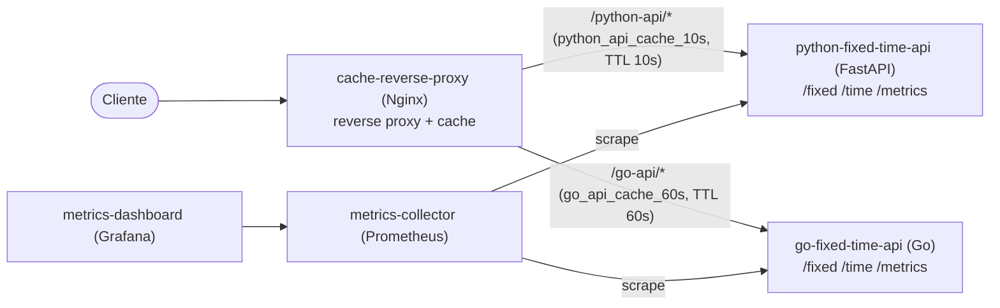
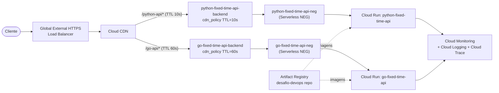

# Arquitetura

## Ambiente local (docker-compose)

Usado para desenvolvimento e demonstração rápida — sobe tudo com `docker compose up`.

- **cache-reverse-proxy** (Nginx) é a camada de cache local: duas `proxy_cache_path` distintas — `python_api_cache_10s` e `go_api_cache_60s` — cada uma com `proxy_cache_valid` diferente (10s / 60s), satisfazendo o requisito de expiração por aplicação. O nome de cada zona já diz qual app cacheia e por quanto tempo.
- **metrics-collector** (Prometheus) faz scrape do endpoint `/metrics` de cada app (contadores de requests e latência).
- **metrics-dashboard** (Grafana) já vem provisionado com datasource e dashboard (`overview.json`).

## Ambiente GCP (Terraform, referência — não aplicado)

Mesmo desenho, só que com componentes gerenciados do Google Cloud, provisionados via `terraform/`.

- **Cloud CDN**, ligado a cada **backend service** (um por app), com `cdn_policy.default_ttl` diferente por app — é o equivalente gerenciado do `cache-reverse-proxy` local, sem precisar operar cache manualmente. Os nomes dos recursos (`python_api_cache_ttl_seconds`, `go_api_cache_ttl_seconds`) já dizem a que app e a que TTL se referem.
- **Cloud Run** roda os dois containers (`python-fixed-time-api`, `go-fixed-time-api` — linguagens diferentes, mesma plataforma de execução), com autoscaling 0→3 instâncias.
- **Artifact Registry** guarda as imagens versionadas por commit SHA (ver `diagrams/update-flow.md`).
- **Cloud Monitoring/Logging/Trace** dão observabilidade nativa sem operar Prometheus/Grafana em produção — métricas de requests, latência, cache hit ratio do CDN e logs estruturados de cada revisão.

## Pontos de melhoria identificados

1. **Cloud Run hoje é público (`allUsers`, via `python_fixed_time_api_public_invoker`/`go_fixed_time_api_public_invoker`)** para o LB alcançar via NEG. Melhor prática: manter o Cloud Run com ingress `INGRESS_TRAFFIC_INTERNAL_LOAD_BALANCER` e usar Cloud Armor / IAP na borda para controle de acesso, em vez de depender só do LB estar na frente.
2. **Sem WAF/proteção DDoS**: adicionar **Cloud Armor** nos backend services (rate limiting, geo-blocking, regras OWASP).
3. **Certificado gerenciado aponta pra domínio fictício** (`desafio-devops.example.com`) — em produção, usar domínio real + Cloud DNS gerenciado via Terraform também.
4. **Cache "tudo ou nada" por rota** (`FORCE_CACHE_ALL`): hoje cacheia `/fixed` e `/time` igual dentro do mesmo backend. Uma evolução seria diferenciar cache por rota (ex: não cachear `/time` ou cachear com TTL menor), usando `Cache-Control` vindo da própria aplicação em vez de forçar no LB.
5. **Sem VPC Service Controls / rede privada**: Cloud Run hoje sobe sem VPC connector. Se precisar falar com bancos/Redis privados no futuro, adicionar Serverless VPC Access.
6. **Observabilidade local (`metrics-collector`/`metrics-dashboard`) não é a mesma da produção (Cloud Monitoring)** — considerar exportar métricas das apps também para Cloud Monitoring via OpenTelemetry Collector, mantendo paridade dev/prod.
7. **Secrets/variáveis de ambiente**: nenhuma app usa segredos hoje, mas o padrão para o futuro é Secret Manager + `google_secret_manager_secret_version`, nunca variável de ambiente em texto plano no Terraform.
