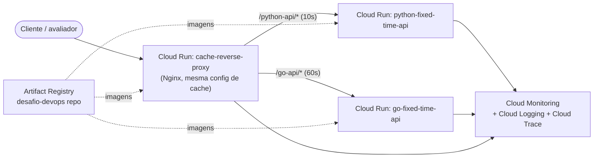
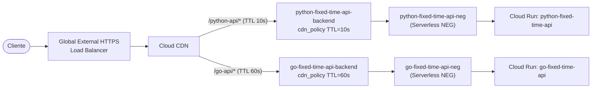

# Arquitetura

## Ambiente local (docker-compose)

Usado para desenvolvimento e demonstração rápida — sobe tudo com `docker compose up`.

- **cache-reverse-proxy** (Nginx) é a camada de cache local: duas `proxy_cache_path` distintas — `python_api_cache_10s` e `go_api_cache_60s` — cada uma com `proxy_cache_valid` diferente (10s / 60s), satisfazendo o requisito de expiração por aplicação. O nome de cada zona já diz qual app cacheia e por quanto tempo.
- **metrics-collector** (Prometheus) faz scrape do endpoint `/metrics` de cada app (contadores de requests e latência).
- **metrics-dashboard** (Grafana) já vem provisionado com datasource e dashboard (`overview.json`).

## Ambiente GCP hoje (aplicado, público)

Provisionado de verdade no projeto `desafio-devops-globo-2026` via `terraform/` (Artifact Registry + Cloud Run). Sem Load Balancer: como não há domínio próprio disponível hoje, o **próprio `cache-reverse-proxy` roda como um terceiro serviço no Cloud Run**, usando `nginx/nginx-cloud.conf` (aponta para os URLs públicos `*.run.app` das duas apps em vez dos nomes de serviço do docker-compose). Ele é o entrypoint público único, com o mesmo cache de 10s/60s.

- Os três serviços (`python-fixed-time-api`, `go-fixed-time-api`, `cache-reverse-proxy`) têm `roles/run.invoker` para `allUsers` — acesso público, como pedido no desafio.
- Cada Cloud Run já ganha um URL HTTPS público nativo (`*.run.app`), sem precisar configurar certificado.
- Autoscaling 0→3 instâncias em cada serviço (escala a zero quando ocioso — custo mínimo).

## Ambiente GCP com Load Balancer + Cloud CDN (referência, não aplicado)

O Terraform completo (`network_lb_cdn.tf`) já existe e passa em `terraform validate`, mas não foi aplicado: exige um domínio real apontando pro IP do Load Balancer para o certificado gerenciado (`google_compute_managed_ssl_certificate`) sair de `PROVISIONING`. É o desenho "produção", com Cloud CDN nativo em vez de Nginx.

- **Cloud CDN**, ligado a cada **backend service** (um por app), com `cdn_policy.default_ttl` diferente por app — é o equivalente 100% gerenciado do `cache-reverse-proxy`, sem precisar operar Nginx. Os nomes dos recursos (`python_api_cache_ttl_seconds`, `go_api_cache_ttl_seconds`) já dizem a que app e TTL se referem.
- **Artifact Registry** guarda as imagens versionadas por commit SHA (ver `diagrams/update-flow.md`).
- **Cloud Monitoring/Logging/Trace** dão observabilidade nativa sem operar Prometheus/Grafana em produção — métricas de requests, latência, cache hit ratio do CDN e logs estruturados de cada revisão.

## Pontos de melhoria identificados

1. **Nginx como cache no Cloud Run (solução de hoje) é um workaround**, não o desenho final: ele mesmo é um ponto único de falha e não tem cache distribuído geograficamente como o Cloud CDN. Evolução natural é migrar pro Load Balancer + Cloud CDN assim que houver um domínio disponível.
2. **Todos os serviços Cloud Run estão públicos (`allUsers`)**, inclusive `python-fixed-time-api` e `go-fixed-time-api` direto (usados hoje só pra debug). Melhor prática: restringir essas duas a aceitar tráfego só do `cache-reverse-proxy` (`INGRESS_TRAFFIC_INTERNAL_LOAD_BALANCER` ou IAM condicionado), deixando só o proxy público.
3. **Sem WAF/proteção DDoS**: adicionar **Cloud Armor** — hoje só é possível na borda de um Load Balancer, outro motivo para migrar pro desenho de LB+CDN.
4. **Certificado gerenciado do LB aponta pra domínio fictício** (`desafio-devops.example.com`) — precisa de um domínio real + Cloud DNS gerenciado via Terraform.
5. **Imagens usam a tag `:latest`**: funciona pra demo, mas não é reprodutível/rastreável. O pipeline de CI/CD (`diagrams/update-flow.md`) já tagga por SHA do commit — adotar isso também no deploy manual.
6. **Cache "tudo ou nada" por rota** (`FORCE_CACHE_ALL` no Cloud CDN / `proxy_cache_valid` no Nginx): hoje cacheia `/fixed` e `/time` igual. Uma evolução seria diferenciar cache por rota via `Cache-Control` vindo da própria aplicação.
7. **Sem VPC Service Controls / rede privada**: Cloud Run hoje sobe sem VPC connector. Se precisar falar com bancos/Redis privados no futuro, adicionar Serverless VPC Access.
8. **Observabilidade local (`metrics-collector`/`metrics-dashboard`) não é a mesma da produção (Cloud Monitoring)** — considerar exportar métricas das apps também para Cloud Monitoring via OpenTelemetry Collector, mantendo paridade dev/prod.
9. **Secrets/variáveis de ambiente**: nenhuma app usa segredos hoje, mas o padrão para o futuro é Secret Manager + `google_secret_manager_secret_version`, nunca variável de ambiente em texto plano no Terraform.
