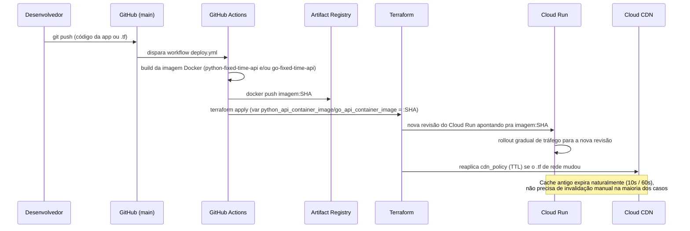

# Fluxo de atualização

Como cada componente (código das apps e infraestrutura) é atualizado, do commit até produção.

## Atualização de código da aplicação
1. Push na branch `main` com mudança em `apps/python-fixed-time-api/**` ou `apps/go-fixed-time-api/**`.
2. GitHub Actions builda a imagem só do serviço que mudou (matrix job com `service: [python-fixed-time-api, go-fixed-time-api]`) e publica no Artifact Registry com a tag = SHA do commit.
3. `terraform apply` atualiza a variável de imagem do Cloud Run correspondente (`python_api_container_image` ou `go_api_container_image`) → Cloud Run cria uma **nova revisão** automaticamente.
4. Cloud Run já faz rollout com health check antes de mover 100% do tráfego (comportamento padrão gerenciado).
5. Cache no CDN não precisa ser invalidado manualmente: como o TTL é curto (10s/60s), a resposta antiga expira sozinha rapidamente. Para mudanças que exigem corte imediato, usar `gcloud compute url-maps invalidate-cdn-cache`.

## Atualização de infraestrutura (Terraform)
1. Push com mudança em `terraform/**` (ex: mudar `python_api_cache_ttl_seconds`/`go_api_cache_ttl_seconds`, adicionar Cloud Armor).
2. Mesmo workflow roda `terraform apply` — hoje direto na `main` (auto-approve), o que é aceitável pra um desafio, mas não pra produção real (ver pontos de melhoria abaixo).
3. Terraform state fica local neste repositório de exemplo; produção real precisa de **backend remoto** (GCS bucket + locking).

## Pontos de melhoria no fluxo de atualização

1. **Sem plano/aprovação antes do apply**: hoje `terraform apply -auto-approve` roda direto na `main`. Melhoria: `terraform plan` como check obrigatório em Pull Request, `apply` só depois de aprovação humana (ambiente `production` no GitHub Actions com required reviewers).
2. **State local**: mover para backend remoto (`gcs` bucket versionado) com state locking, para permitir trabalho em equipe sem conflito.
3. **Sem rollback automatizado**: se uma revisão nova do Cloud Run falhar, hoje depende de rollback manual (`gcloud run services update-traffic --to-revisions=REVISION=100`). Melhoria: usar **Cloud Deploy** com canary/rollback automático baseado em métricas de erro.
4. **Um único ambiente**: não há separação dev/staging/prod. Melhoria: usar workspaces do Terraform ou diretórios `envs/dev`, `envs/prod` com suas próprias variáveis.
5. **Autenticação via Workload Identity Federation** (já adotada no workflow, sem chave de Service Account em texto plano) — ponto positivo a manter, evitar regressão para chaves JSON estáticas.
